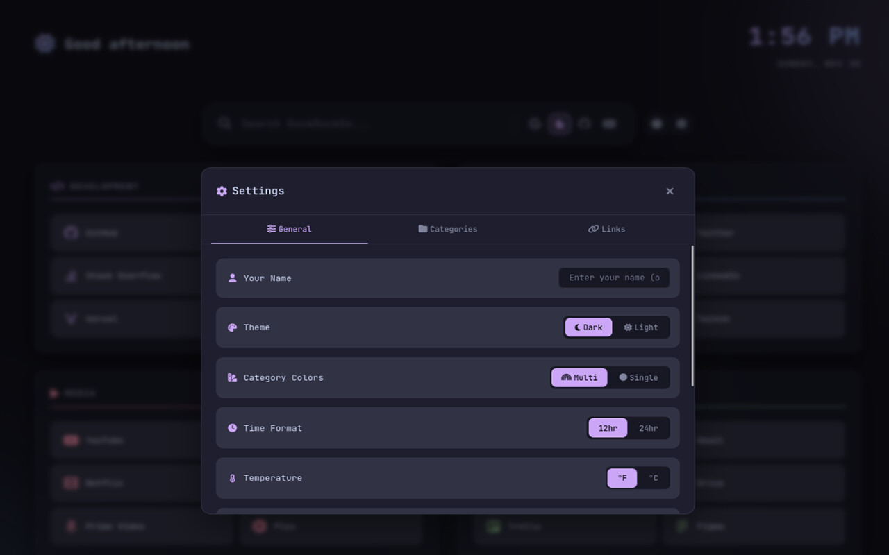
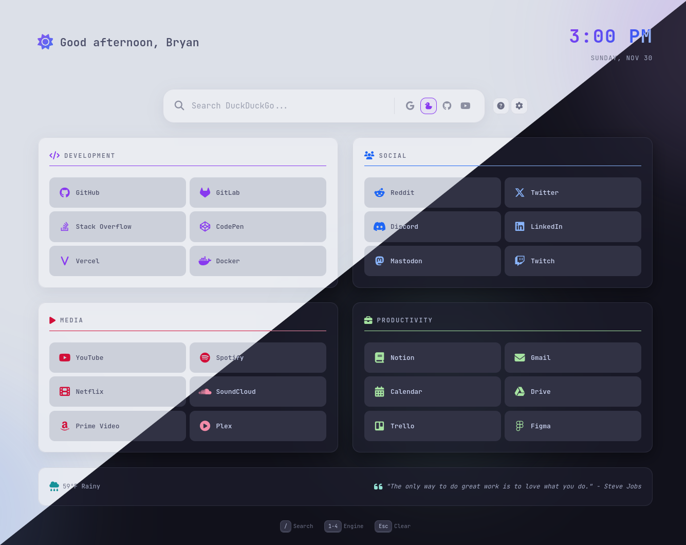
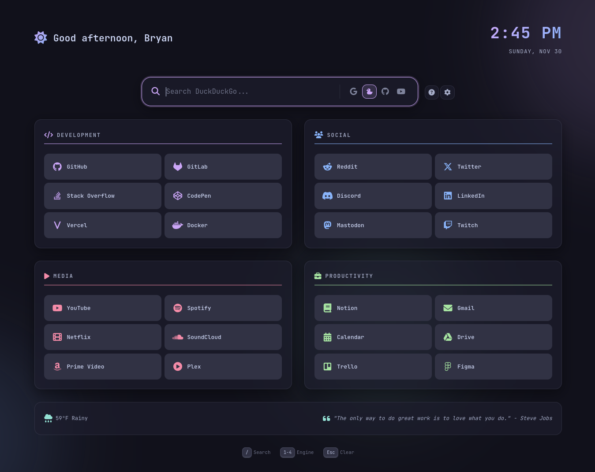
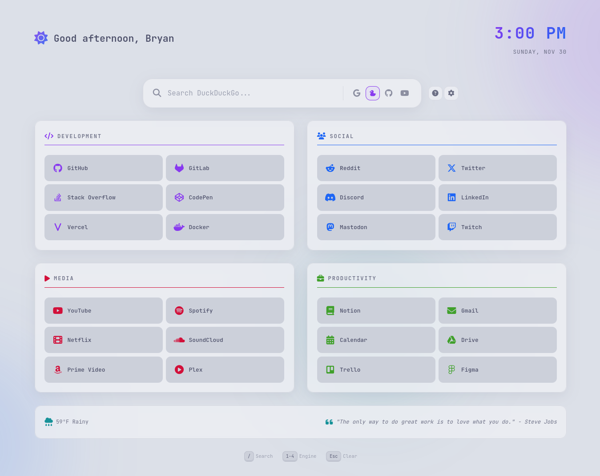

# ☕ Sip - Your Cozy New Tab Page

Transform your browser's new tab into a beautiful, personalized workspace with Sip. Featuring stunning color themes, glassmorphism effects, and intelligent customization, Sip makes every new tab a delightful experience.

---

## 🎉 UPDATES - December 2025

### 🎨 **9 Color Schemes with Light/Dark Modes**
Sip now includes 9 beautiful color schemes, each with both light and dark variants:

<details>
<summary><strong>Catppuccin</strong> - Warm, soothing pastels (original default)</summary>

#### Dark Mode (Mocha)


#### Light Mode (Latte)


</details>

<details>
<summary><strong>Nord</strong> - Cool, arctic-inspired blues and grays</summary>

#### Dark Mode


#### Light Mode


</details>

<details>
<summary><strong>Gruvbox</strong> - Retro, warm earthy tones with high contrast</summary>

#### Dark Mode


#### Light Mode


</details>

<details>
<summary><strong>Tokyo Night</strong> - Modern deep blues with vibrant accents</summary>

#### Dark Mode


#### Light Mode


</details>

<details>
<summary><strong>Dracula</strong> - Classic vibrant purples and cyans</summary>

#### Dark Mode


#### Light Mode


</details>

<details>
<summary><strong>Solarized</strong> - Precision colors designed for readability</summary>

#### Dark Mode


#### Light Mode


</details>

<details>
<summary><strong>Kanagawa</strong> - Japanese-inspired muted, natural tones</summary>

#### Dark Mode (Wave)


#### Light Mode (Lotus)


</details>

<details>
<summary><strong>Ayu</strong> - Minimal modern with bright accents</summary>

#### Dark Mode


#### Light Mode


</details>

<details>
<summary><strong>Monochrome</strong> - Pure black & white for maximum focus</summary>

#### Dark Mode (White on Black)


#### Light Mode (Black on White)


</details>

### ⚙️ **Enhanced Settings & Customization**
- **Backup & Restore** - Export and import all your settings, categories, and links (v1.1.1)
- **Click Time to Toggle** - Click the clock to quickly switch between 12h/24h format
- **Show Seconds Option** - Display seconds on the clock for precise timekeeping
- **Link Behavior Control** - Choose to open links in same window, new tab, or new window
- **Keyboard Shortcuts Toggle** - Show or hide keyboard hint overlays
- **Color Scheme Dropdown** - Easy selection of any color scheme

### 🔗 **Social Links Integration**
- New **Social Links** settings tab with 10 pre-configured platforms
- Add your social media URLs (Facebook, Instagram, Twitter/X, LinkedIn, GitHub, YouTube, TikTok, Discord, Reddit, Mastodon)
- Toggle visibility for each platform
- Display social icons in the footer

### 🎯 **Footer Customization**
- New **Footer Settings** tab with complete layout control
- Customize left, center, and right footer sections independently
- Choose from: Weather, Social Links, Quotes, or Blank for each section
- Default: Weather (left), Blank (center), Quotes (right)

### 📚 **Improved Help & Documentation**
- Help content moved to a dedicated tab in Settings
- Removed standalone help button for cleaner UI
- Comprehensive icon customization guide integrated into settings

### 🎭 **UI/UX Improvements**
- Convert color scheme selector to dropdown for scalability
- Removed redundant settings (quotes toggle now managed via Footer tab)
- Better responsive design for settings with tab wrapping
- Enhanced color mode visibility based on theme selection
- Developer credits section at the bottom

<details>
<summary>Settings Panel Screenshots</summary>

#### Settings Overview


#### Settings Panels (High Resolution)


</details>

---

## ✨ Key Features

**Beautiful Design**
- **9 stunning color schemes** - Catppuccin, Nord, Gruvbox, Tokyo Night, Dracula, Solarized, Kanagawa, Ayu, Monochrome
- **Light & Dark modes** for every color scheme (18 total theme combinations)
- Modern glassmorphism UI with ambient glow effects
- Smooth animations and responsive layout
- Multi-color or monochrome category accent options

**Smart Search**
- Integrated search respecting your default search engine (Chrome)
- Quick engine switching between 9 search providers (Google, DuckDuckGo, GitHub, Git, YouTube, Bing, Amazon, Wikipedia, Internet Archive)
- Keyboard shortcuts for lightning-fast navigation

**Personalization**
- Dynamic time-based greetings with beautiful icons
- Real-time weather with OpenWeather API integration
- **Click clock to toggle 12h/24h** format instantly
- Optional seconds display on clock
- Customizable quick links organized by categories (up to 8 categories, 10 links each)
- Toggle between Fahrenheit and Celsius
- **Social links integration** with 10 popular platforms
- **Customizable footer layout** (left/center/right sections)
- **Backup & Restore** - Easily migrate settings between browsers

**Productivity**
- Organize your favorite sites in customizable categories
- **Link behavior control** (open in same window, new tab, or new window)
- Built-in help system integrated into settings
- All settings persist locally (no data collection)
- Keyboard shortcuts: `/` for search, `1-9` for engines, `Esc` to clear
- Optional keyboard hints overlay

**Privacy First**
- No data collection or tracking
- All preferences stored locally on your device
- Open source and transparent

## 🎯 Perfect For

- Developers who want quick access to GitHub, Stack Overflow, and dev tools
- Anyone who values beautiful, functional design
- Users who want a personalized browsing experience
- Privacy-conscious individuals

## 🔒 Privacy & Permissions

**Required Permissions:**
- `search` - To integrate with your browser's default search engine (Chrome only)

**What We DON'T Do:**
- No data collection or analytics
- No tracking or monitoring
- No remote servers (except OpenWeather API if you configure it)
- All settings stored locally using browser's localStorage

See our full [Privacy Policy](https://github.com/bgibson72/start-page-v3/blob/main/PRIVACY.md) for complete details.

## 📸 Screenshots & More

Visit our [GitHub repository](https://github.com/bgibson72/start-page-v3) for:
- Detailed screenshots
- Customization guide
- Icon usage instructions
- Development information
- Source code

## 🆘 Support

Need help? Have suggestions?
- Open an issue on [GitHub](https://github.com/bgibson72/start-page-v3/issues)
- Read our detailed [README](https://github.com/bgibson72/start-page-v3)

---

Made with ☕ and 💜 using Catppuccin themes



<details>
<summary>📸 Screenshots - Click to expand</summary>

### Original Theme Examples

#### Catppuccin Dark (Mocha)


#### Catppuccin Light (Latte)


#### Settings Panel


### New Color Schemes (December 2025)

20 additional screenshots showcasing all 9 color schemes in both light and dark modes are available in `/screenshots/Updated Screens/`. These include:

- **Catppuccin** (Mocha & Latte)
- **Nord** (Polar Night & Snow Storm)
- **Gruvbox** (Dark & Light)
- **Tokyo Night** (Night & Day)
- **Dracula** (Dark & adapted Light)
- **Solarized** (Dark & Light)
- **Kanagawa** (Wave & Lotus)
- **Ayu** (Dark & Light)
- **Monochrome** (Black & White)

Each screenshot demonstrates the glassmorphism effects, customizable categories, and beautiful color harmony of each theme.

### New Features Showcase

- Social Links footer widget with platform icons
- Customizable footer sections (Weather, Socials, Quotes)
- Enhanced settings with 6 tabs (General, Categories, Links, Social, Footer, Help)
- Color scheme dropdown selector
- Clock with seconds display option

</details>

## ✨ Features

- **Catppuccin Themes** - Mocha (dark) and Latte (light) color palettes
- **Glassmorphism UI** - Modern frosted glass effects with ambient glows
- **Multi-Engine Search** - Quick switch between popular search engines and developer resources
- **Dynamic Greeting** - Personalized time-based greetings with sunrise/sun/sunset/moon icons
- **Quick Links** - Categorized bookmarks (Development, Social, Media, Productivity)
- **Weather Widget** - Current weather with °F/°C toggle
- **Settings Panel** - Toggle 12hr/24hr clock, temperature units, and theme
- **Inspirational Quotes** - Random quotes to brighten your day
- **Keyboard Navigation** - Fast access with keyboard shortcuts
- **Responsive Design** - Works on all screen sizes

---

## 🧩 Installation

**Sip** is available as a browser extension:

- **Chrome Web Store** - Coming soon!
- **Firefox Add-ons** - Coming soon!

Once published, simply install from your browser's extension store and Sip will replace your new tab page.

---

## 🚀 Standalone Installation

### Clone the Repository

```bash
git clone https://github.com/bgibson72/start-page-v3.git
cd start-page-v3
```

### Set as Browser Homepage

1. Open the `index.html` file in your browser
2. Copy the file path (e.g., `file:///home/username/start-page-v3/index.html`)
3. Set this as your browser's homepage in settings

**Or host locally:**

```bash
# Using Python
python -m http.server 8080

# Then set http://localhost:8080 as your homepage
```

## ⚙️ Customization

### Change Your Name

Edit `script.js` and find the `userName` variable near the top:

```javascript
const userName = 'Bryan';  // Change to your name
```

### Add/Remove Quick Links

Edit `index.html` and modify the link cards in each category section:

```html
<a href="https://your-site.com" class="link-card">
    <span class="link-icon"><i class="fa-brands fa-icon-name"></i></span>
    <span class="link-text">Site Name</span>
</a>
```

Browse [Font Awesome Icons](https://fontawesome.com/icons) for icon options.

### Modify Categories

Each category is a `<section class="link-group">` in `index.html`. You can:
- Rename categories by changing the `<h2>` text
- Add new categories by duplicating a section
- Remove categories by deleting a section

The grid automatically adjusts (2 columns for even count, 3 for odd).

### Change Color Scheme

Edit `style.css` and modify the CSS variables in `:root`:

```css
:root {
    /* Catppuccin Mocha Colors */
    --crust: #11111b;
    --mantle: #181825;
    --base: #1e1e2e;
    --surface0: #313244;
    --surface1: #45475a;
    --surface2: #585b70;
    --text: #cdd6f4;
    --subtext: #a6adc8;
    --primary: #cba6f7;    /* Mauve - accent color */
    --secondary: #89b4fa;  /* Blue */
    --accent: #f5c2e7;     /* Pink */
    /* ... */
}
```

### Change Weather Units

In `script.js`, find the `fetchWeather` function and change `units=imperial` to `units=metric` for Celsius:

```javascript
const response = await fetch(
    `https://api.open-meteo.com/v1/forecast?latitude=${lat}&longitude=${lon}&current_weather=true&temperature_unit=fahrenheit`
);
```

Change `fahrenheit` to `celsius` for metric units.

### Add Custom Quotes

Edit the `quotes` array in `script.js`:

```javascript
const quotes = [
    "Your custom quote here.",
    "Another inspiring message.",
    // Add more quotes...
];
```

## ⌨️ Keyboard Shortcuts

| Key | Action |
|-----|--------|
| `/` | Focus search bar |
| `1-4` | Switch search engine |
| `Esc` | Clear search / unfocus |

## 🎨 Icons

This startpage uses:
- [Font Awesome 6](https://fontawesome.com/) for most icons
- [Nerd Fonts](https://www.nerdfonts.com/) for DuckDuckGo duck and time-of-day icons

## 🔒 Privacy

This extension respects your privacy. See our [Privacy Policy](PRIVACY.md) for details.

**TL;DR:** No data collection. All preferences stored locally on your device.

## 📄 License

MIT License - feel free to modify and use as you wish!

---

Made with ☕ and 💜 using Catppuccin
